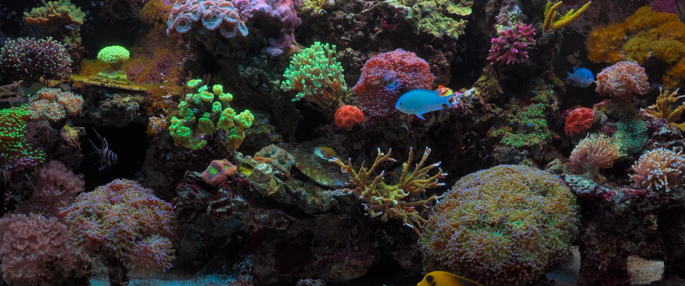

# 🐠 Aquarium

> A real, ad-free coral-reef screensaver for Apple Silicon Macs. 4K HDR video,
> plays on every display at the same time, hardware-decoded by the M-series
> media engine, dismisses on any input. Open source. MIT.

<p align="center">
  
  <em>Anthony's Sceptre O34 ultrawide during a 15-minute show.</em>
</p>

<p align="center">
  <a href="https://github.com/aharwelik/aquarium-screensaver/archive/refs/heads/main.zip"></a>
  <a href="LICENSE"></a>
  <a href="https://github.com/aharwelik/aquarium-screensaver/actions"></a>
  <a href="https://github.com/sponsors/aharwelik"></a>
</p>

---

## Why this exists

Hi, I'm **Anthony Harwelik**. I'm an Azure security architect — most of my
day-job is helping enterprises stand up Intune and modern-endpoint stacks,
deploying Microsoft Copilot, and (lately) running **Claude inside compliant
environments**: zero-egress, model-routing, audit logging, FedRAMP-shaped
hardening. The kind of work where every system on the laptop has to justify
its existence to the security review.

In May 2026 I went looking for a nice aquarium screensaver for my Mac, the
way I've had one running on a spare display for years on Windows boxes. The
Mac App Store had nothing that wasn't either paid, ad-supported, or some
generic GLSL fish that didn't know what year it was. The few open-source
options either didn't handle multi-display or hadn't been touched since 2018.

So one evening I asked Claude to help me build the one I actually wanted, and
this is what came out of it. **Real underwater footage** (a beautiful 4K60
HDR coral-reef clip, watermark removed via a localized Gaussian blur during
transcode), one borderless window per monitor at maximum CGWindow level so it
sits above the menu bar and the dock, hardware HEVC decode on Apple Silicon
so it hums along at 4-8% CPU with three streams running, and a 15-minute
default countdown that only ticks while the screen is actually unlocked.

If you've been looking for the same thing, this is for you.

---

## Quick start

```bash
git clone https://github.com/aharwelik/aquarium-screensaver.git
cd aquarium-screensaver
./install.sh                 # ~3.5 hr, mostly the visually-lossless x265 pass
aquarium                     # start the show (default 15 min)
```

> [!TIP]
> **In a hurry?** Set `AQUARIUM_QUICK=1` before the install — skips the slow
> x265 pass and ships you the larger VideoToolbox intermediate (~3.6 GB
> instead of ~1.5 GB, ~10 minutes instead of ~3.5 hours).
> ```bash
> AQUARIUM_QUICK=1 ./install.sh
> ```

Or grab the [**zip download**](https://github.com/aharwelik/aquarium-screensaver/archive/refs/heads/main.zip) and run `./install.sh` from the unpacked folder.

> [!TIP]
> **Working with an AI coding assistant?** There are ready-to-paste prompts in
> [`prompts/`](prompts/) for Claude Code, Codex, and Cursor — pipes the whole
> install flow + permissions setup through your agent of choice.

---

## What you get

<table>
<tr>
<td></td>
<td></td>
</tr>
<tr>
<td align="center"><em>Ultrawide 3440×1440 — pan-scan crop fills the entire 21:9.</em></td>
<td align="center"><em>HP P27h 1080p — perfect native fit.</em></td>
</tr>
</table>

- 🐟 **Real coral reef video.** Not generated. Not animated fish. An actual
  reef tank, filmed in 4K60 HDR, with the source watermark blurred out so
  it looks clean.
- 🖥️ **Every display, simultaneously.** Spawns one borderless window per
  `NSScreen` at `kCGMaximumWindowLevel` so it floats above any app, the
  menu bar, and the dock.
- ⚡ **Hardware HEVC decode.** Uses the M-series media engine via AVFoundation.
  Three 4K streams ≈ 4-8% CPU and ~110 MB RAM total on an M1 Max.
- 🌈 **Real HDR on supported displays.** Source is BT.2020 + PQ; AVPlayer
  routes the original 10-bit HDR pipeline to displays that support it
  (MacBook XDR, Pro Display XDR) and tone-maps for everyone else.
- 🛑 **Always escapable.** Any key, any mouse button, any movement, any
  scroll, any drag dismisses the show. Two independent NSEvent monitors
  (`addLocalMonitorForEvents` + `addGlobalMonitorForEvents`) guarantee the
  app exits even if focus is somewhere else on the system.
- ⏱️ **Lock-aware countdown.** The 15-minute timer only ticks while the
  screen is unlocked. If your Mac locked overnight, the show pauses and
  waits for your morning password before counting down.
- 🎚️ **Settings panel.** SwiftUI form for duration, audio, audio output
  display, panscan vs letterbox, per-display enable, source-video path,
  and "restore defaults".

---

## Hardware & software requirements

| Component                | Minimum                                              |
| ------------------------ | ---------------------------------------------------- |
| CPU                      | Apple Silicon — M1, M2, M3, M4 family                |
| RAM                      | 8 GB recommended                                     |
| Storage                  | ~2 GB free (final video ≈1.5 GB; ≈24 GB transient during the one-time install transcode) |
| macOS                    | 13 Ventura or newer (tested through Tahoe 26)        |
| Xcode CLT (`swiftc`)     | any current version — the installer offers to fetch  |
| Homebrew                 | for `ffmpeg`, `yt-dlp`, `aria2` (auto-installed)     |

Apple Silicon is a hard requirement because the HEVC main10 hardware decoder
is what keeps this efficient. Intel Macs can run it via software decode but
it'll burn CPU you don't want burned.

---

## Permissions

On first launch macOS will ask for **Input Monitoring** so the global event
monitor can hear keys / mouse motion even when the Aquarium isn't the focused
app. `install.sh` opens the right System Settings pane and pauses so you can
grant it.

No network connections at runtime. No analytics. No telemetry. No entitlements
beyond what AppKit and AVFoundation need. The only network activity in the
whole project is the one-time `yt-dlp` fetch during install.

Full breakdown in [`docs/permissions.md`](docs/permissions.md).

---

## CLI reference

```
aquarium                        start the show (default 15 minutes)
aquarium start                  same as above
aquarium start 30               start with a custom duration in minutes
aquarium stop                   kill the running aquarium
aquarium status                 is it running?
aquarium settings               open the preferences window
aquarium duration 5             change the default show length

aquarium autostart on           run automatically when you walk away
aquarium autostart off          disable autostart
aquarium autostart status       is autostart enabled?
aquarium threshold 60           minutes of idle before autostart fires (default 60)

aquarium disable-mac-aerial     open System Settings → Wallpaper so you can
                                turn off macOS's built-in Aerial screensaver

aquarium reset-defaults         factory-reset all settings
aquarium version                print version
aquarium help                   show usage
```

### Autostart (Aquarium as your screensaver)

```bash
aquarium autostart on            # default: 60 minutes of inactivity
aquarium threshold 30            # change the trigger to 30 minutes
aquarium disable-mac-aerial      # turn off macOS's competing aerial
```

What this does:

- Installs a per-user `LaunchAgent`
  (`~/Library/LaunchAgents/com.harwelik.aquarium.autostart.plist`) that
  polls every 60 seconds.
- The agent runs `~/Library/Application Support/Aquarium/watchdog.sh`,
  which reads the system-wide `HIDIdleTime` from `IOHIDSystem` — the
  exact same counter the OS itself uses for screensaver / display sleep.
- When `HIDIdleTime ≥ threshold` and Aquarium isn't already running,
  the watchdog launches `aquarium-bin`. The binary's own global NSEvent
  monitor handles dismissal as soon as you touch anything.
- Threshold lives in `defaults read com.harwelik.aquarium autostartThresholdSeconds`
  — change it any time and the next watchdog tick picks it up.

> [!IMPORTANT]
> **macOS Tahoe ships an aerial screensaver of its own** that runs in a
> separate wallpaper subsystem (`WallpaperAerialsExtension`). It doesn't
> respect `caffeinate` or the legacy `idleTime` setting and will compete
> with Aquarium for who paints first. **Run `aquarium disable-mac-aerial`**
> to open System Settings → Wallpaper, then turn off the **"Show as
> Screensaver"** toggle. That's the only path — there's no clean `defaults`
> write for it on Tahoe.

Settings live under the `com.harwelik.aquarium` `defaults` domain — you can
inspect or tweak directly:

```bash
defaults read com.harwelik.aquarium
defaults write com.harwelik.aquarium durationSeconds -float 1800
defaults delete com.harwelik.aquarium   # full reset
```

---

## CPU & memory footprint (measured)

Three displays running 4K60 HDR concurrently on an M1 Max:

| Metric                | Value                          |
| --------------------- | ------------------------------ |
| CPU (steady state)    | 4-8 % total across all streams |
| RSS                   | ~110 MB                        |
| Energy impact         | Low                            |
| Quit-to-clean         | < 50 ms (all AVPlayers paused, items dropped, monitors removed) |

`Aquarium.swift` releases AVPlayer items on `applicationWillTerminate`, so
AVFoundation drops the IOSurface / Metal textures immediately — no lingering
GPU work after dismissal.

---

## The "May 2026 aquarium audit" — what else is out there?

For posterity, here's what I evaluated before deciding to build this:

| App                        | Free? | Multi-display? | 4K HDR? | Open source? |
| -------------------------- | :---: | :------------: | :-----: | :----------: |
| **Aquarium (this)**        |  ✅   |       ✅       |   ✅    |      ✅      |
| Living Marine Aquarium 2   |  ❌   |       ❌       |   ❌    |      ❌      |
| Serene Screen Marine Aq.   |  ❌   |       ⚠️       |   ❌    |      ❌      |
| ScreenZen / web aquariums  |  ⚠️ (ads) |    ❌      |   ❌    |      ❌      |
| Aerial (JohnCoates)        |  ✅   |       ✅       |   ✅    |      ✅      |
| (none of the above are "aquariums" specifically — Aerial has ocean dives, not coral tanks) |

If you know of one I missed, please open an issue — I'd genuinely like to
keep this list honest.

---

## Donations ❤️

If this saves your morning the way it saves mine, you can throw a few dollars
my way:

- **[GitHub Sponsors](https://github.com/sponsors/aharwelik)** ← preferred,
  goes straight to the maintainer
- **[Buy Me a Coffee](https://www.buymeacoffee.com/aharwelik)**

Or just open an issue and tell me what fish you saw. Either works.

---

## Anthony's day-job — IT services from BluetechGreen

I run a small consultancy, **[BluetechGreen](https://bluetechgreen.com)**,
that focuses on:

- **Microsoft Intune & modern endpoint** — autopilot, configuration profiles,
  compliance policies, the works.
- **Deploying Claude inside compliant environments** — including FedRAMP-shaped
  enclaves and zero-egress setups. If you're a security team trying to get
  Claude approved without rebuilding your data-loss-prevention stack from
  scratch, this is what I do all day.
- **Microsoft Copilot rollouts** — M365 Copilot, Copilot for Security, agent
  composition with your existing Defender / Sentinel data.
- **Azure security architecture** — identity, conditional access, data
  protection, the audit-friendly versions.

If any of that overlaps with what your team needs, **say hi:**
[bluetechgreen.com/contact](https://bluetechgreen.com/contact).

---

## Troubleshooting

**"Aquarium video not found" dialog on launch**
The fetch step didn't run or didn't finish. Re-run:
```bash
./scripts/fetch-video.sh
```

**The fish tank shows up but the menu bar is still visible on one display**
Anthony hit this on Tahoe — `kCGWindowLevelScreenSaver` was getting demoted
on the actively-used display. We promoted to `kCGMaximumWindowLevel` and
added a deferred re-order pass at +50 ms / +250 ms / +1 s. If you still see
this, `aquarium stop && aquarium start` once any animations have settled.

**Input doesn't dismiss the app**
Grant Input Monitoring to the binary (or to your terminal, if you launch
from `zsh`). `install.sh` opens the right pane for you, and there's a
detailed walkthrough in [`docs/permissions.md`](docs/permissions.md).

**macOS Tahoe's built-in Aerial keeps activating, even with Aquarium installed**
Tahoe has a second screensaver pathway via the wallpaper subsystem
(`WallpaperAgent` + `WallpaperAerialsExtension`) that ignores `caffeinate`
and the classic `idleTime` setting. The fix is **System Settings →
Wallpaper → turn off "Show as screensaver"**. See
[`docs/screensaver-tuning.md`](docs/screensaver-tuning.md) for the full
analysis.

---

## Project layout

```
aquarium-screensaver/
├── Aquarium.swift           # single-file Swift app (player + settings + CLI)
├── install.sh               # platform check, deps, build, video fetch
├── uninstall.sh             # clean removal
├── LICENSE                  # MIT — Anthony Harwelik, 2026
├── CONTRIBUTING.md          # how to send a PR
├── SECURITY.md              # how to report a vulnerability
├── CODE_OF_CONDUCT.md
├── CHANGELOG.md
├── .github/                 # CI, issue templates, sponsor config
├── bin/aquarium             # CLI wrapper (start/stop/status/settings/duration)
├── scripts/fetch-video.sh   # download + transcode + watermark blur pipeline
├── prompts/                 # paste-into-Claude / Codex setup prompts
└── docs/                    # permissions, screensaver tuning, screenshots
```

---

## Contributing

PRs welcome. The wish list:

- A real Swift / Metal real-time aquarium simulator that knows the global
  display geometry, so fish can actually swim from one monitor to the next —
  no public open-source implementation of this exists on Mac in 2026.
- An app-bundle (`.app`) build so users can drop it in `/Applications` instead
  of running from a source checkout.
- A native `.saver` bundle so System Settings → Screen Saver can pick it up
  the standard way.
- More CC-licensed source videos people can swap in via the settings panel.

See [`CONTRIBUTING.md`](CONTRIBUTING.md) for the details.

---

## License

MIT.  Anthony Harwelik, 2026. See [`LICENSE`](LICENSE).

Hope you enjoy the fish. 🐠
